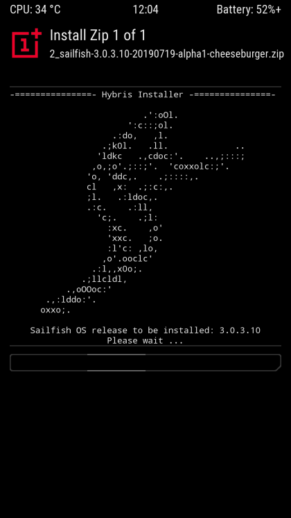

# hybris-installer
A visually appealing & extensible custom Hybris Installer script by default specialized for cheeseburger (OnePlus 5) & dumpling (OnePlus 5T) devices.

This replaces the default hybris-boot installer script implementation & requires a [custom pack_package-droid-updater](https://github.com/sailfishos-oneplus5/droid-config-cheeseburger/blob/master/kickstart/pack_package-droid-updater) file in your droid-configs which expects **this whole repo** to be cloned in `$ANDROID_ROOT/hybris/hybris-installer/`.

Feel free to fork and adapt (see guide below the screenshot) to your device's needs! ^^

## Screenshot



## Adaptation guide

To get a quick start you can simply execute the following in your PLATFORM_SDK environment:
```
cd $ANDROID_ROOT/
git clone https://github.com/sailfishos-oneplus5/hybris-installer hybris/hybris-installer/
mkdir hybris/droid-configs/kickstart/
curl -L https://git.io/Je2JI -o hybris/droid-configs/kickstart/pack_package-droid-updater
```

I do however recommend forking the project to keep up-to-date with any changes I may make here and rebase easily when considering using this long-term :)

**NOTICE:** Here are few things that may or may not require changes on your part:

1. `pack_package-droid-updater` kickstart
- Variable `LOS_VER`: Should be obvious why [this variable](https://git.io/Je2ky) may need to be changed; make it match your LineageOS / CyanogenMod base number e.g. `LOS_VER="14.1"` etc. Mentions of it can also be adapted for another check or removed entirely if the port is not based on LineageOS

2. `update-binary` shell script
- Treble: On some devices the `/vendor` partition may be something else such as `/odm`, or alternatively on older bases such as `14.1` it wouldn't be present. Remove / modify [this](https://git.io/Je2JF) and [this](https://git.io/Je2JA) part from your `update-binary` script. Changing the error message is also approperiate :)
- Non-LineageOS ports: Adapt or remove [this check](https://git.io/Je2Jp). Removing all parts mentioning the `droid-boot` image could also be something to take a look at if [dual-boot support for Android](https://github.com/sailfishos-oneplus5/boot-switcher) is impossible / not needed
- Fixups: [The init script](https://git.io/Je2Tq) "fixes" are mostly unnecessary (just disable stuff that doesn't exist on OP5* devices) and will likely break the boot process of other devices => you should remove the lines
- Boot partition: The boot partition paths [here](https://git.io/Je2ki) and [here](https://git.io/Je2kP) (`/dev/block/bootdevice/by-name/boot`) may need to be replaced to match your device needs. This could also be an absolute partition like `/dev/block/sde19` etc
- SFOS rootfs extraction failure: Get the `tar` binary from [here](https://github.com/sailfishos-oneplus5/hybris-installer/tree/8b90aa2536a61a571c0feb87ecd24bc9766ff251/hybris-installer) & place it in your own local tree accordingly, add [the following lines](https://git.io/Je2JX) and replace [the extraction line](https://git.io/Je2TV) with `tar -xj -f $ARCHIVE -C $ROOT/` in your `update-binary` script ([this line](https://git.io/Je2T0) should also be removed)
